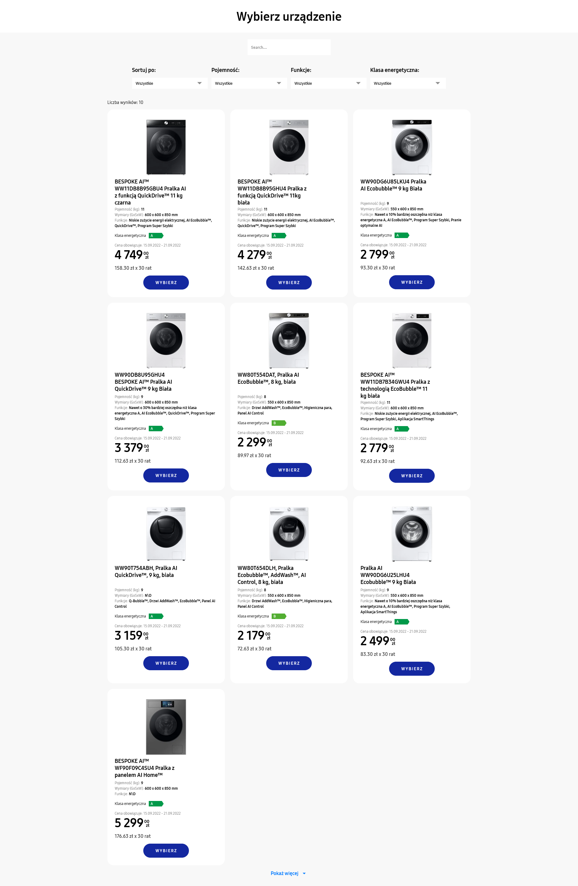
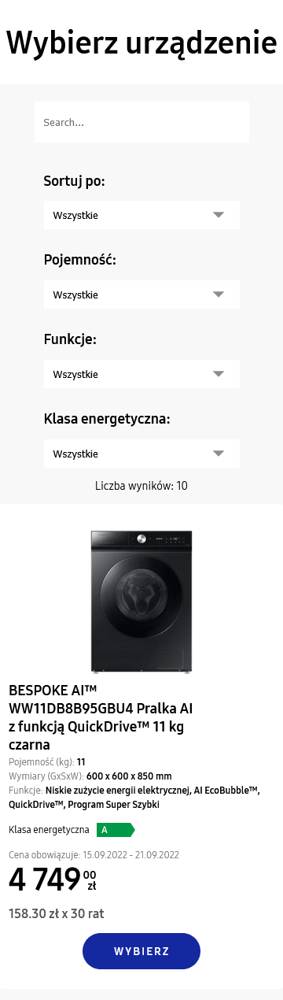

# Junior AEM Frontend Developer

The project is an interview task. It's a webpage displaying washing machines from [Samsung](https://www.samsung.com/pl/washers-and-dryers/washing-machines/) store.
I am fetching data from:

```
https://searchapi.samsung.com/v6/front/b2c/product/finder/newhybris?type=08010000&siteCode=pl&onlyFilterInfoYN=N&keySummaryYN=Y&specHighlightYN=Y&num=10&filter1=04z01
```

filter1=04z01 - fetch washing machines.  
num=10 - fetch 10 products (if the response is shorter, then there are no more products available).

Filter navbar uses arguments:

1. start - pagination
2. sort - sorting products
3. filter2 - washing machine drum capacity
4. filter5 - technologies / functionality
5. filter6 - energry grade

Index in filter indicates category. I wanted to make it look as close as possible to the provided figma mockup, but the order of items in navbar is a little different due to mapping through the API response.

## Live Demo

[https://frontend-interview-task-rojek.web.app/](https://frontend-interview-task-rojek.web.app/)

## Tech stack

- Vite
- TypeScript
- React
- Zustand
- Axios
- Firebase (just deployment)

## Run Locally

```
npm run dev
```

## Screenshots

### Desktop



### Mobile


